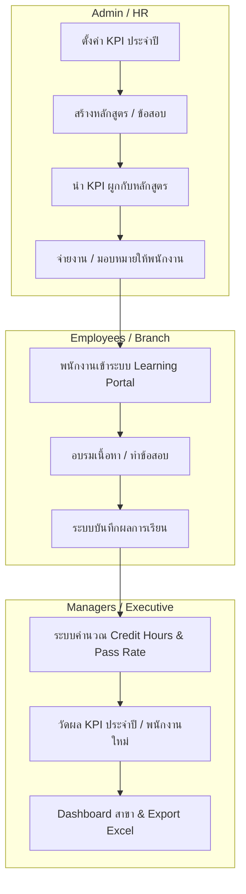
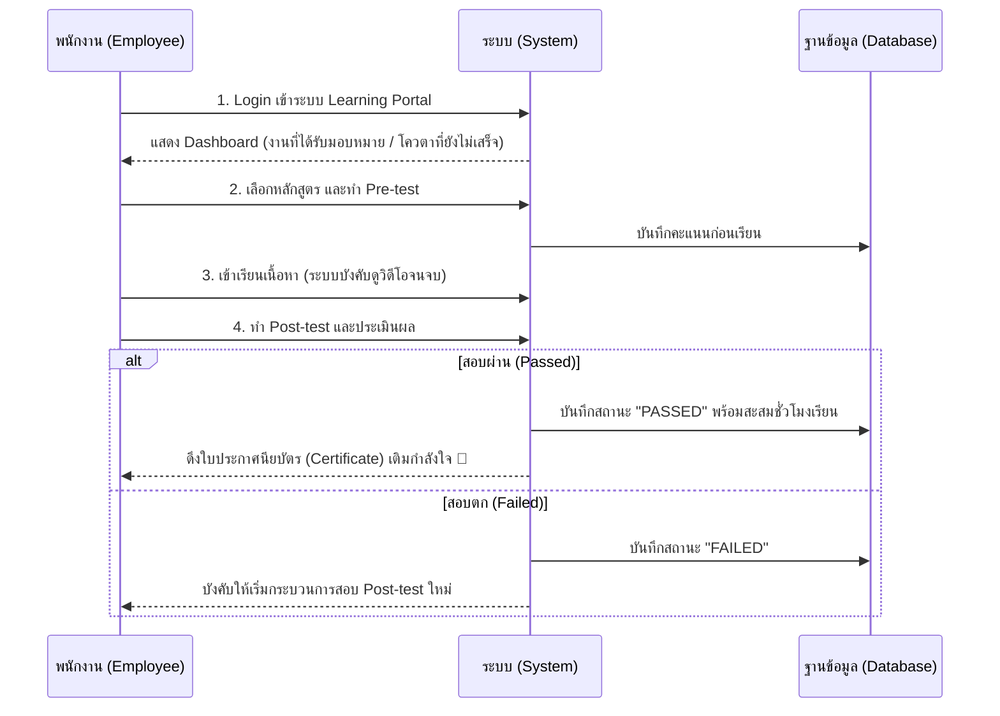

# MKPI System Business Flow (Presentation Guide)

เอกสารนี้รวบรวม Flow การทำงานของระบบ MKPI ตั้งแต่ต้นน้ำ (Setup) ไปจนถึงปลายน้ำ (Reporting) ออกแบบมาเพื่อให้คุณนำไปใช้ทำสไลด์นำเสนอ (Presentation) หรืออธิบายให้ผู้บริหาร/ทีมงานฟังได้อย่างเป็นขั้นตอนครับ

---

## 🗺️ ภาพรวมระบบ (System Overview)

> [!NOTE]
> ระบบแบ่งผู้ใช้งานออกเป็น 2 กลุ่มหลัก ได้แก่ **Admin/HR** (ผู้ควบคุมระบบและตั้งเป้าหมาย) และ **พนักงาน** (ผู้เรียนและถูกวัดผล KPI)

---

## 📝 Flow 1: การเตรียมการ (Admin Setup Flow)
*สไลด์นี้ใช้อธิบายเส้นทางการเตรียมหลักสูตร เป้าหมาย และการมอบหมายงาน*

1. **จัดการองค์กร (Organization Setup)**
   - นำเข้า (Import) รายชื่อพนักงาน, รหัสสาขา, และระบุ ตำแหน่ง (Role & Level)
   - *จุดเด่น:* ระบบแยกแยะอัตโนมัติว่าใครเป็น Manager (ต้องอบรม LMS นอก) หรือพนักงานสาขา
2. **สร้างหลักสูตรและคลังข้อสอบ (Course & Quiz Creation)**
   - สร้างหลักสูตร ใส่เครดิตชั่วโมง และกำหนดระยะเวลา (เช่น บังคับจบใน 14 วัน สำหรับ Onboarding)
   - อัปโหลดเนื้อหา (Video, PDF) และดึงข้อสอบจาก "คลังข้อสอบ" มาตั้งเป็น Pre-test / Post-test
3. **กำหนดเป้าหมาย KPI (KPI Definition)**
   - สร้าง KPI ประจำปี (เช่น "พนักงานต้องมีความรู้ความปลอดภัย 100%")
   - **นำหลักสูตรมาผูกลิงก์กับ KPI ข้อนี้** เพื่อใช้เป็นตัวชี้วัดความสำเร็จ
4. **การมอบหมาย / นำเข้าผล (Assignment & Import)**
   - โยนหลักสูตรเข้า Dashboard ของพนักงาน
   - *จุดเด่น:* หากเป็นระดับ Manager ที่อบรมมาจากระบบภายนอก Admin สามารถ Import ไฟล์ Excel ผลการอบรมเข้ามาโยงในระบบ MKPI ได้ทันที (ระบบมี Auto-calculate พ.ศ. เป็น ค.ศ.)

---

## 🏃 Flow 2: การเรียนรู้ (Employee Execution Flow)
*สไลด์นี้ใช้อธิบายถึง User Experience เวลาพนักงานใช้งานจริง*

---

## 📈 Flow 3: การวัดผลและรายงาน (Reporting & KPI Evaluation)
*สไลด์นี้สำคัญที่สุดสำหรับผู้บริหาร เน้นจุดแข็งด้าน Analytics*

ระบบจะรวบรวม Data จากพนักงานทั้งหมด มาวิเคราะห์ออกมาเป็น **4 รายงานเชิงลึก (4 Core Reports)**

### 1. รายงาน KPI ประจำปี (Executive Annual KPI Dashboard)
- **Pain Point ที่แก้ได้:** ผู้บริหารมองไม่เห็นภาพรวมว่าระดับ "สาขา" หรือ "ภูมิภาค" ผ่าน KPI บริษัทยัง
- **Process:** ระบบเอาพนักงานในแต่ละสาขามาคำนวณ ว่าผ่านหลักสูตรที่ผูกกับ KPI ตัวนั้นคิดเป็นกี่เปอร์เซ็นต์ (เช่น สาขาสยามผ่าน KPI ความปลอดภัย 80%) แสดงผลเป็นตาราง Matrix ทันที

### 2. รายงาน KPI พนักงานใหม่ (Onboarding KPI)
- **Pain Point ที่แก้ได้:** พนักงานใหม่หมดโปรฯ หรือพ้น 14 วัน แต่ยังไม่ได้เทรนนิ่ง
- **Process:** ระบบผูกวันที่ `startDate` ดึงรายงานเทียบว่าพนักงานใหม่คนไหน เรียนหลักสูตรบังคับเกินเวลา 14 วัน (โชว์ไฟแดงแจ้งเตือนสถานะ Overdue)

### 3. สถิติหลักสูตร (Course Analytics)
- **Pain Point ที่แก้ได้:** ไม่รู้ว่าหลักสูตรที่ HR ทำมามันยากไป หรือง่ายไป
- **Process:** แสดง Pass Rate และ *ค่าพัฒนาการ* (เทียบ % Post-test กับ Pre-test) และมีก้อน **Missing / Overdue List** จัดเรียงหน้ากระดานประจาน(?) พนักงาน/สาขา ที่ยังไม่เข้าเรียน ให้โหลด Excel ทวงงานได้เลย

### 4. ประวัติรายบุคคล (Employee Transcript)
- **Pain Point ที่แก้ได้:** กระดาษหาย หรือพนักงานไม่รู้ยอดสะสมั่วโมงตัวเอง
- **Process:** เช็คประวัติรายคนแบบ 360 องศา ดูยอด "Credit Hours" รวม เพื่อเอาไปประกอบการประเมินขึ้นเงินเดือนปลายปี ปริ้นท์ออก Excel เป็นหลักฐานได้
